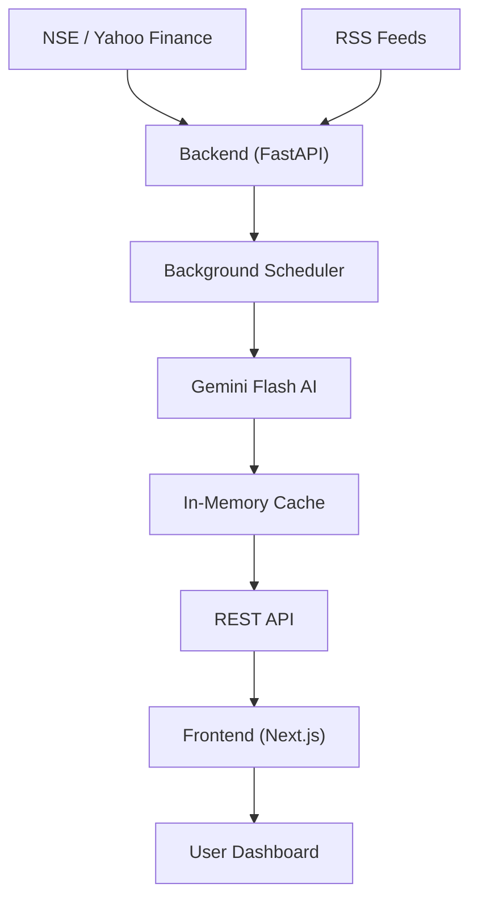

# MarketPulse — AI Market Intelligence Dashboard

A high-performance, minimalist market intelligence dashboard that compresses complex Indian and global market data into a 5-minute actionable summary.


## 🚀 Features

- **AI Market Summary**: 5-minute actionable brief powered by Gemini 1.5 Flash.
- **Market Mood**: Real-time sentiment indicator (Risk-On / Risk-Off).
- **Smart Watchlist**: Automated screening for volume spikes, momentum, and breakouts.
- **Sector Heatmap**: Lightweight performance visualization across NSE sectors.
- **Options Snapshot**: NIFTY options chain metrics (PCR, Max Pain, OI).
- **News Compression**: Aggregated and sector-grouped news from top financial sources.
- **Zero-Latency UI**: All data is pre-generated and cached in the background; the frontend never waits for upstream APIs.

## 🏗️ Architecture



## 🛠️ Tech Stack

- **Frontend**: Next.js 15 (App Router), Tailwind CSS, Shadcn/UI, Lucide Icons.
- **Backend**: FastAPI (Python 3.12), Pydantic v2, HTTPX.
- **AI**: Google Gemini 1.5 Flash (via `google-genai` SDK).
- **Data Sources**: `yfinance`, NSE (Direct JSON), Feedparser.

## 📦 Project Structure

```text
├── backend/            # FastAPI application
│   ├── services/       # Data fetching & AI logic
│   ├── routes/         # API endpoints
│   ├── normalizer/     # Data transformation layer
│   └── scheduler.py    # Background refresh loops
├── frontend/           # Next.js application
│   ├── src/app/        # Pages & Layouts
│   ├── src/components/ # UI Components
│   └── src/lib/        # API utilities
```

## 🚀 Quick Start

### Backend Setup
1. `cd backend`
2. `python -m venv venv && source venv/bin/activate`
3. `pip install -r requirements.txt`
4. Create `.env` with `GEMINI_API_KEY`
5. `uvicorn main:app --reload`

### Frontend Setup
1. `cd frontend`
2. `npm install`
3. Create `.env.local` with `NEXT_PUBLIC_API_URL=http://localhost:8000/api/market`
4. `npm run dev`

---

## ⚖️ Disclaimer
*MarketPulse is for informational purposes only. It does not provide trade recommendations or financial advice. All data is subject to delay as per upstream providers.*
