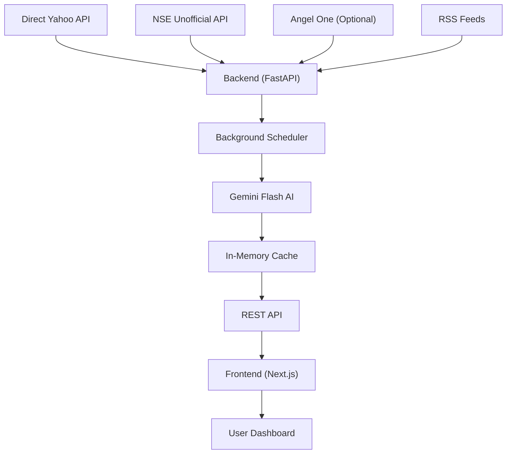

# GyanDheesh — AI Market Intelligence Compressed

A high-performance, minimalist market intelligence dashboard that compresses complex Indian and global market data into a 5-minute actionable summary.

## 🚀 Features

- **AI Market Summary**: High-density 'Intelligence Compression' briefs powered by Gemini Flash.
- **Market Mood**: Real-time sentiment indicator (Risk-On / Risk-Off).
- **Smart Watchlist**: Automated screening for volume spikes, momentum, and breakouts.
- **Sector Heatmap**: Lightweight performance visualization across NSE sectors (Direct Yahoo API).
- **Options Snapshot**: NIFTY options chain metrics (PCR, Max Pain, OI) from NSE.
- **News Compression**: Aggregated and sector-grouped news from top financial sources.
- **Resilient Data Architecture**: Hybrid fetching using Direct Yahoo APIs, NSE Stealth headers, and optional Angel One integration.

## 🏗️ Architecture

## 🛠️ Tech Stack

- **Frontend**: Next.js 15 (App Router), Tailwind CSS, Shadcn/UI, Lucide Icons.
- **Backend**: FastAPI (Python 3.12), Pydantic v2, HTTPX (Stealth Fetching).
- **AI**: Google Gemini Flash (Intelligence Compression).
- **Data Sources**: Yahoo Finance (Primary Charts), NSE Unofficial (Options), Angel One SmartAPI (Optional LTP), RSS Feeds.

## 🚀 Quick Start

### Backend Setup
1. `cd backend`
2. `python -m venv venv && source venv/bin/activate`
3. `pip install -r requirements.txt`
4. Create `.env` based on `.env.example`
5. `uvicorn main:app --reload`

### Frontend Setup
1. `cd frontend`
2. `npm install`
3. Create `.env.local` with `NEXT_PUBLIC_API_URL=http://localhost:8000/api/market`
4. `npm run dev`

---

## ⚖️ Disclaimer
*GyanDheesh is for informational purposes only. It does not provide trade recommendations or financial advice. All data is subject to delay as per upstream providers.*
